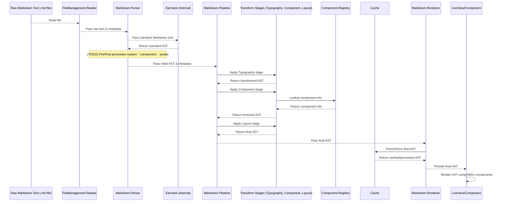

# Markdown Processing Pipeline

> **Lifecycle: historical orientation; partially stale.** Module names,
> component syntax, cache behavior, and TODOs below may not describe the shipped
> system. Start with `_PROJECT_DOCS/README.md` and the current compiler/renderer
> source and tests.

## Goal

This document explains the process by which Markdown (`.md`) files within this project are parsed, transformed, and ultimately rendered as rich content, potentially including interactive Phoenix LiveView components, within the application.

The primary goal is to allow content authors to write primarily in standard Markdown while enabling developers to embed custom, reusable Phoenix components directly into that content.

## High-Level Flow

The conversion from raw Markdown text to final renderable output follows a multi-stage pipeline:

**Simplified Flow:**

`Raw Markdown Text` -> `Reader` -> `Parser` -> `Initial AST` -> `Pipeline (Transforms)` -> `Final AST` -> `Cache` -> `Renderer/LiveView` -> `HEEx Output`

## Key Components & Responsibilities

*   **`Portfolio.Content.FileManagement.Reader`**:
    *   Reads `.md` files from the filesystem.
    *   Extracts YAML frontmatter and raw Markdown content.
    *   Determines content type (`note`, `case_study`) and locale based on file path.
    *   Passes raw content and parsed frontmatter metadata downstream.

*   **`Portfolio.Content.Markdown.Parser`**:
    *   Receives raw Markdown text and frontmatter from the `Reader`.
    *   **Uses `Earmark` internally** to parse standard Markdown syntax into an initial Abstract Syntax Tree (AST).
    *   **(TODO: Custom Syntax Handling)**: This module is *also* responsible for recognizing and parsing custom component syntax (e.g., `::my-component{attr="val"} ... ::end-my-component`). It needs to extract this information and integrate it into the AST produced by Earmark, likely via pre- and post-processing steps around the Earmark call. See "The Custom Syntax Challenge" below.
    *   Outputs the initial, combined AST (representing both standard Markdown and custom components).

*   **`Portfolio.Content.Markdown.Pipeline`**:
    *   Orchestrates the application of multiple transformation stages to the AST.
    *   Takes the initial AST from the `Parser`.
    *   Passes the AST sequentially through each configured `Transform` module.
    *   Outputs the final, transformed AST.

*   **`Portfolio.Content.Markdown.Transforms.*` (e.g., `Typography`, `Component`, `Layout`)**:
    *   Each module represents a single stage in the pipeline, operating on the AST.
    *   **`Typography`**: Converts standard element nodes (like `{"p", ...}`, `{"h1", ...}`) into `{:typography, ...}` nodes, adding styling attributes (size, font, dropcap).
    *   **`Component`**: Finds all component nodes (`{:component, ...}` from custom syntax, or nodes designated as components like `{"img", ...}`). Looks up the component type in the `Registry` and enriches the node's metadata.
    *   **`Layout`**: Examines frontmatter metadata (passed via pipeline options) and may restructure the AST by wrapping content in layout components (e.g., columns).

*   **`Portfolio.Content.Markdown.Component.Registry`**:
    *   A GenServer acting as a central lookup for defined components.
    *   Maps component types (e.g., `:figure`, `:typography`, `:my_component`) to the Elixir module and function responsible for rendering them.
    *   Populated automatically by modules using `Portfolio.Content.Markdown.Component.Definition` or manually via its API.

*   **`Portfolio.Content.Markdown.Component.Definition`**:
    *   A helper module (`use ...`) for defining Phoenix components that can be used within the Markdown pipeline.
    *   Automatically registers the component with the `Registry` upon compilation or runtime initialization via PubSub.

*   **`Portfolio.Content.Markdown.Renderer`**:
    *   Provides the main public API (`render/3`, `render_and_cache/4`).
    *   Invokes the `Parser` and `Pipeline` to get the final AST.
    *   Interacts with the `Cache` to store and retrieve the processed *final AST*.
    *   Provides helpers (`render_ast/1`) used by LiveView components/templates to recursively render the final AST into HEEx.

*   **`Portfolio.Cache`**:
    *   A wrapper around `Cachex` used to cache the *final AST* produced by the pipeline. This avoids redundant parsing and transformation for unchanged content, improving performance.

## The Custom Syntax (`::component::`) Challenge

A core requirement is embedding custom Phoenix components using syntax like `::my-component{attr="val"} ... ::end-my-component`. Standard Markdown parsers like Earmark don't understand this.

**Why is this handled in the `Parser`?**

1.  **Leveraging Earmark:** We want Earmark to parse all standard Markdown.
2.  **Transformer Input:** Pipeline transformers (`Typography`, `Component`, etc.) are designed to work on an already-structured **AST**, not raw text patterns.
3.  **Syntax Recognition:** The `Parser`'s fundamental job is recognizing syntax (grammar) in the raw text.

**How it's (planned to be) handled:**

The `Parser` module (specifically the functions marked with `TODO` in `preprocess_custom_components` and `insert_custom_components`) needs to:

1.  **Pre-scan:** Before sending text to Earmark, find `::component:: ... ::end::` blocks.
2.  **Extract:** Parse the component name, attributes, and inner content. Store this data.
3.  **Replace:** Replace the custom block in the raw text with a unique placeholder (e.g., `<!-- CUSTOM_COMPONENT_ID_1 -->`).
4.  **Parse:** Send the modified text (with placeholders) to Earmark to get a standard AST.
5.  **Post-process:** Traverse the AST returned by Earmark. Find the nodes representing the placeholders.
6.  **Insert:** Replace those placeholder nodes with the correct `{:component, type, attrs, children, meta}` AST nodes, using the data extracted in step 2. The `children` might need recursive parsing if the component block contains Markdown.

This approach keeps the transformers clean, even though it adds complexity to the `Parser`.

## AST Structure (Simplified)

The pipeline works with an AST primarily composed of tuples:

*   **Standard HTML-like Elements:** `{tag :: String.t(), attributes :: list() | map(), children :: list(), metadata :: map()}`
    *   Example: `{"p", [%{class: "intro"}], ["Hello"], %{}}`
*   **Typography Components:** `{:typography, tag :: String.t(), attributes :: map(), children :: list(), metadata :: map()}`
    *   Created by the `Typography` transform.
    *   Example: `{:typography, "h1", %{size: "2xl"}, ["Title"], %{}}`
*   **Custom/Resolved Components:** `{:component, type :: atom(), attributes :: map(), children :: list(), metadata :: map()}`
    *   Created by the `Parser` for custom syntax, potentially transformed further by the `Component` transform. `metadata` is enriched by the `Component` transform with registry info.
    *   Example: `{:component, :figure, %{src: "/img.png"}, [], %{module: FigureComponent, function: :render}}`
*   **Text Nodes:** Simple `String.t()` values.

## Caching

To optimize performance, the **final AST** produced after all pipeline transformations is cached using `Portfolio.Cache`.

*   The cache key is typically derived from the content's unique ID (e.g., database ID).
*   `Renderer.render_and_cache/4` handles checking the cache before processing and storing the result.
*   `Renderer.invalidate_cache/1` can be used to clear the cache for specific content when it's updated.
*   HTML output is *not* cached; rendering from the AST happens dynamically in the LiveView/Component using `render_ast/1`.

## Developer User Journeys

Here's how to approach common tasks:

1.  **Understanding the Basic Flow:**
    *   Follow the diagram above.
    *   Read the `@moduledoc` for `Reader`, `Parser`, `Pipeline`, `Renderer`.

2.  **Adding/Modifying a Custom Component (e.g., `::gallery::`)**:
    *   Create/modify the Phoenix component module (e.g., `GalleryComponent.ex`).
    *   Use `Component.Definition` within that module to define its type (`:gallery`), attributes, etc. This handles registration.
    *   **(TODO)** Update `Markdown.Parser` (`preprocess_custom_components`, `insert_custom_components`) to recognize the `::gallery::` syntax and generate the `{:component, :gallery, ...}` AST node.
    *   Ensure the `Component` transform stage is active in the pipeline.

3.  **Changing How Standard Markdown is Rendered (e.g., styling `<blockquote>`)**:
    *   Identify the relevant `Transform` stage (likely `Typography`).
    *   Modify its `apply/2` function to change the output AST node for blockquotes (e.g., add attributes).
    *   Alternatively, if the element is rendered by a specific component (like `` might become `<.figure>`), modify that component's definition or rendering logic.

4.  **Adding a New Transformation Rule (e.g., add `rel="noopener"` to external links)**:
    *   Create a new module in `lib/portfolio/content/markdown/transforms/`.
    *   Implement the `apply/2` function to traverse the AST and modify link nodes.
    *   Add your new module to the `:stages` list where `Pipeline.process` is called (likely in `Markdown.Renderer`). Consider the order carefully.

5.  **Debugging a Rendering Issue**:
    *   **Syntax:** Is the raw Markdown (`.md` file) correct? Check standard syntax and any `::component::` syntax.
    *   **Parser:** Add temporary logging/inspection in `Markdown.Parser` *after* Earmark and *after* custom component insertion to see the initial AST. Is it structured as expected?
    *   **Transforms:** Add logging *before* and *after* each stage in `Markdown.Pipeline.apply_stage/3` to see how the AST changes. Is a transform modifying the AST incorrectly? Is the stage order wrong?
    *   **Renderer/Cache:** Check the final AST being passed to `render_ast`. Is it correct? Try bypassing the cache (`force_refresh: true`) via `render_and_cache`.
    *   **Final Component:** Check the rendering logic in the specific Phoenix component (`Typography`, `Figure`, etc.) or the `render_ast/1` function itself if it's a basic element.
